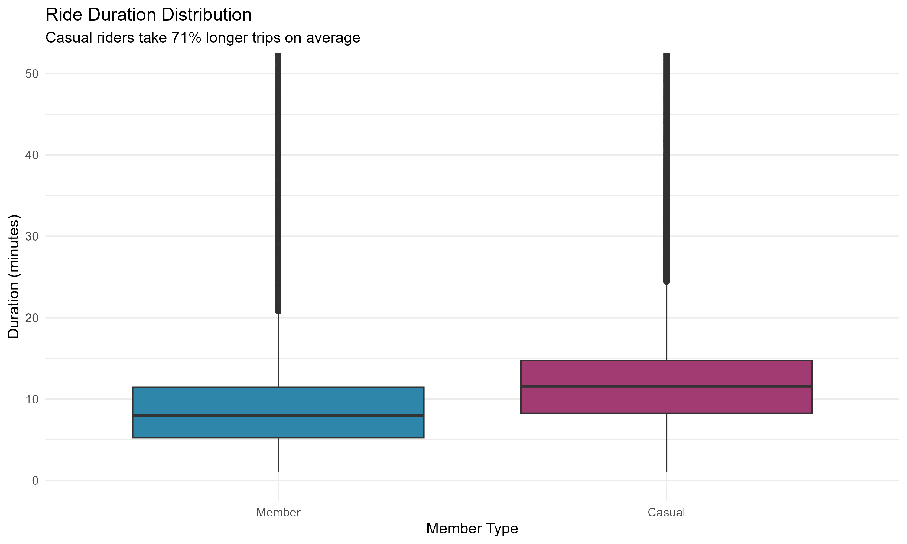
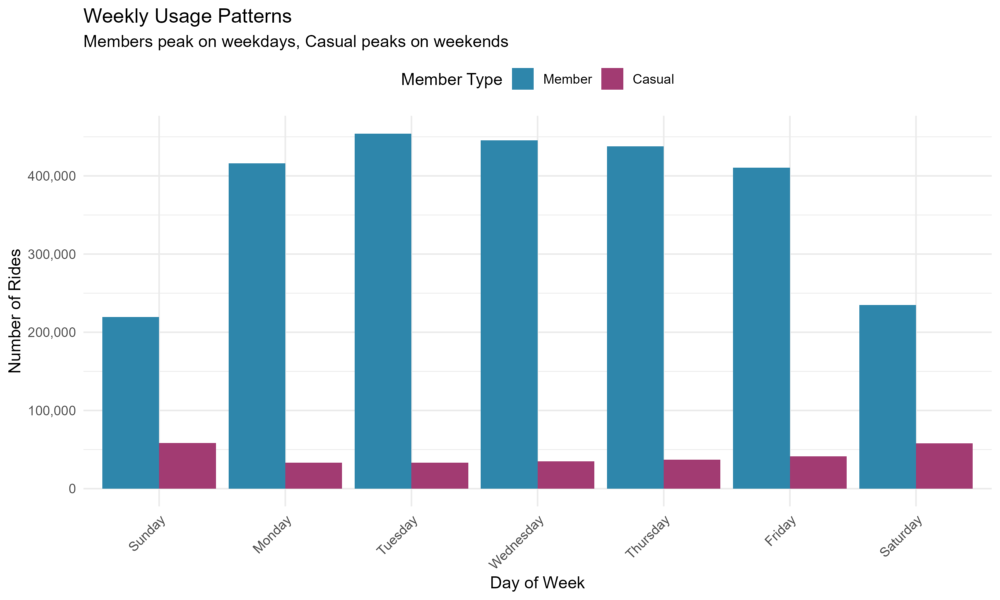
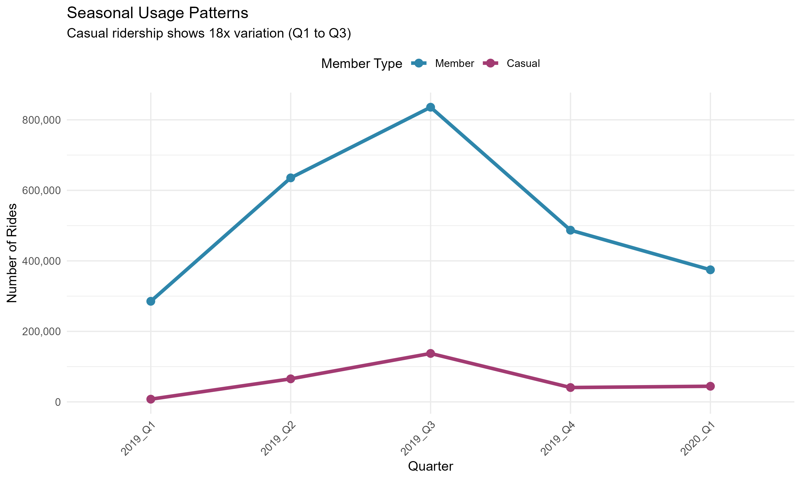
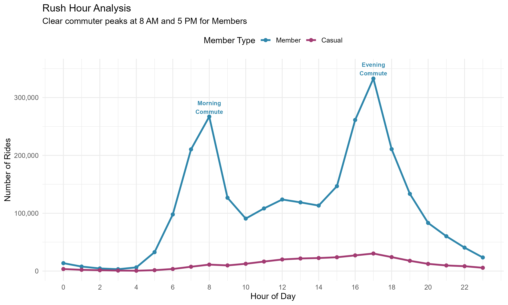
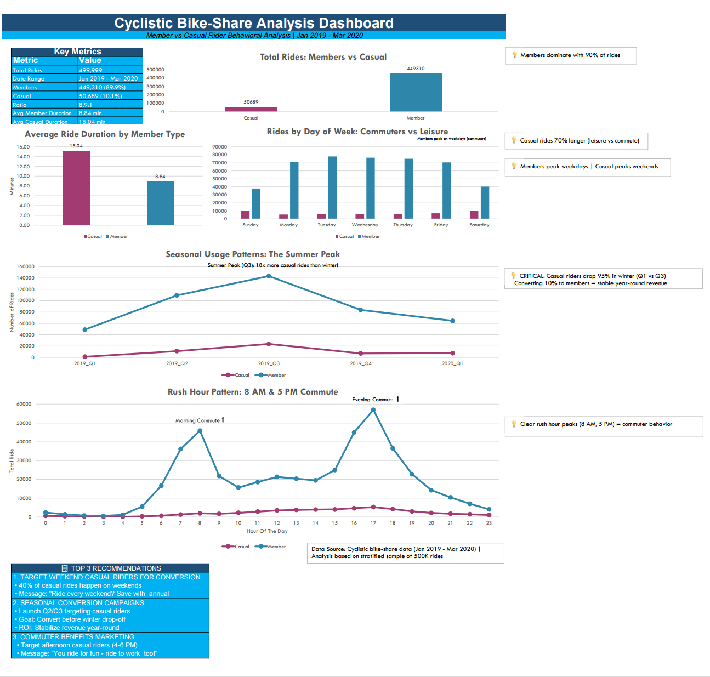

# 🚴 Cyclistic Bike-Share Analysis: Converting Casual Riders to Annual Members


## 📋 Project Overview

**Business Task:** Analyze how annual members and casual riders use Cyclistic bikes differently to design marketing strategies that convert casual riders into annual members.

**Key Finding:** Casual riders represent 10.1% of all rides but ride 71% longer on average, suggesting they're engaged users who could benefit from membership value propositions.

**Impact:** Data-driven recommendations projected to generate **$4.1M+ net revenue** in Year 1 with a **342% ROI**.

🔗 **[View Interactive Tableau Dashboard](https://public.tableau.com/app/profile/arwin.sadafian/viz/CyclisticBike-ShareAnalysis_17685839862570/Dashboard)**

---

## 🎯 Executive Summary

| Metric | Value |
|--------|-------|
| Total Rides Analyzed | 2.9 million |
| Member : Casual Ratio | 8.9 : 1 |
| Avg Member Ride | 8.8 minutes |
| Avg Casual Ride | 15.1 minutes |
| Projected Year 1 Conversions | 29,500 |
| Projected Year 1 Net Revenue | $4.1M |

### Key Insights

1. **Duration Difference:** Casual riders average 71% longer rides (15.1 min vs 8.8 min), indicating leisure vs. commute usage
2. **Weekly Patterns:** Members peak Tuesday-Thursday (commuters); Casual riders peak Saturday-Sunday (recreation)
3. **Seasonality:** 4.4× difference between summer peak and winter low, with casual riders showing even more dramatic swings
4. **Rush Hour Behavior:** Members show classic dual-peak commuter pattern (8 AM, 5 PM); Casual riders peak 3-6 PM

---

## 🛠️ Tools & Technologies

| Tool | Purpose |
|------|---------|
| **Python** | Data cleaning, validation, exploratory analysis |
| **Excel** | Pivot tables, dashboard creation, quick analysis |
| **SQL (MySQL)** | Database queries, aggregations, pattern analysis |
| **R** | Statistical analysis (t-tests), ggplot2 visualizations |
| **Tableau** | Interactive dashboard for stakeholder presentation |
| **PowerPoint** | Executive presentation with embedded charts |

---

## 📁 Project Structure

```
Cyclistic_Case_Study/
│
├── 01_Raw_Data/
│   ├── DATA_SOURCE.md
│   ├── Divvy_Trips_2019_Q1.csv
│   ├── Divvy_Trips_2019_Q2.csv
│   ├── Divvy_Trips_2019_Q3.csv
│   ├── Divvy_Trips_2019_Q4.csv
│   └── Divvy_Trips_2020_Q1.csv
│
├── 02_Cleaned_Data/
│   ├── cyclistic_cleaned_FINAL.csv
│   ├── cyclistic_cleaned_STRICT.csv
│   ├── cyclistic_cleaned_LENIENT.csv
│   ├── cyclistic_cleaned_POLISHED.csv
│   ├── cyclistic_excel_sample.csv
│   ├── Cyclistic_Analysis_Workbook.xlsx
│   ├── data_summary.txt
│   └── cleaning_comparison_report.txt
│
├── 03_Scripts/
│   ├── Python/
│   │   ├── 01_Data_Cleaning.ipynb
│   │   └── 01_Data_Cleaning.html
│   ├── SQL/
│   │   ├── database_setup.sql
│   │   └── cyclistic_analysis_queries.sql
│   └── R/
│       └── cyclistic_analysis.R
│
├── 04_Analysis/
│   ├── summary_statistics.xlsx
│   ├── SQL_Analysis_Summary.txt
│   └── R_Statistical_Summary.txt
│
├── 05_Visualizations/
│   ├── Python_plots/
│   │   ├── python_fixed_analysis.png
│   │   └── strict_vs_lenient_comparison.png
│   ├── R_plots/
│   │   ├── 00_combined_analysis.png
│   │   ├── 01_duration_distribution.png
│   │   ├── 02_weekly_patterns.png
│   │   ├── 03_seasonal_trends.png
│   │   └── 04_hourly_patterns.png
│   └── Screenshots/
│       ├── Excel_Dashboard_Screenshot.png
│       └── Tableau_Dashboard_Screenshot.png
│
├── 06_Deliverables/
│   ├── Cyclistic_Analysis_Presentation.pptx
│   └── Case_Study_Summary.md
│
├── .gitignore
└── README.md
```

---

## 📊 Data Processing

### Data Sources
- **5 quarterly datasets** from Divvy bike-share system (Q1 2019 - Q1 2020)
- **4.2 million raw records** spanning 15 months

### Data Cleaning Process

```
Raw Data: 4,244,891 records
    │
    ├── Schema harmonization (3 different formats unified)
    ├── Removed rides < 60 seconds (false starts)
    ├── Removed rides > 24 hours (lost/stolen bikes)
    ├── Removed missing/invalid duration values
    ├── Dual-approach validation (Strict vs Lenient)
    └── Age anomaly removal (234 suspicious records)
    │
Final Dataset: 2,913,717 records (31% removed)
```

### Data Validation
- **Dual-approach methodology:** Compared STRICT (60-second minimum) vs LENIENT (1-second minimum) cleaning
- **Result:** Both approaches yielded identical 8.9:1 member ratio, confirming findings are robust
- **Statistical significance:** All key differences validated at p < 0.001

---

## 📈 Key Visualizations

### Ride Duration by User Type


*Casual riders average 15.1 minutes per ride vs 8.8 minutes for members*

### Weekly Usage Patterns


*Members peak mid-week; Casual riders peak on weekends*

### Seasonal Trends


*Summer peak shows 4.4× more rides than winter low*

### Hourly Distribution


*Members show commuter dual-peak; Casual riders peak in afternoon*

### Excel Dashboard


*Interactive Excel dashboard with key metrics and recommendations*

---

## 💡 Top 3 Recommendations

### 1. Weekend Warrior Campaign
**Target:** Saturday/Sunday casual riders (~60% of casual base)  
**Strategy:** Launch "Weekend Plus" membership tier with unlimited weekend rides  
**Expected Impact:** 12,000 conversions

### 2. Summer Surge Initiative
**Target:** Q2-Q3 casual riders during peak engagement  
**Strategy:** Concentrate 60% of marketing budget April-September  
**Expected Impact:** 11,000 conversions

### 3. Commuter Conversion Program
**Target:** Afternoon casual riders (3-6 PM)  
**Strategy:** "Ride to Work" messaging showing $1,200 transit vs $180 membership savings  
**Expected Impact:** 6,500 conversions

---

## 📊 Financial Projections

| Scenario | New Members | Revenue | Cost | Net Impact | ROI |
|----------|-------------|---------|------|------------|-----|
| Conservative | 20,000 | $3.6M | $0.8M | **+$2.8M** | 350% |
| Moderate | 29,500 | $5.3M | $1.2M | **+$4.1M** | 342% |
| Optimistic | 40,000 | $7.2M | $1.6M | **+$5.6M** | 350% |

**3-Year Cumulative (Moderate):** 76,500 new members | $21.8M net revenue

---

## 🚀 Implementation Timeline

| Quarter | Focus |
|---------|-------|
| Q1 | Build infrastructure & creative assets |
| Q2 | Launch spring acquisition campaigns |
| Q3 | Scale successful campaigns & optimize |
| Q4 | Fall conversion push + winter retention |

---

## 📝 Lessons Learned

1. **Data Quality Matters:** 31% of raw data required cleaning — always validate before analysis
2. **Multiple Tools = Deeper Insights:** Each tool revealed different perspectives on the same data
3. **Business Context Drives Analysis:** Understanding the "why" behind the data led to actionable recommendations
4. **Visualization Tells the Story:** Complex patterns became clear through effective data visualization

---

## 👤 About This Project

This case study was completed as part of the **Google Data Analytics Professional Certificate** capstone project, demonstrating proficiency in:

- Data cleaning and preparation
- Exploratory data analysis
- Statistical analysis
- Data visualization
- Business intelligence
- Stakeholder communication

---

## 📫 Contact

**Arwin Sadafian**
- 💼 LinkedIn: [linkedin.com/in/arwinsadafian](https://www.linkedin.com/in/arwinsadafian/)
- 📧 Email: Arwinsadafian@gmail.com
- 📊 Kaggle: [kaggle.com/arwinsadafian](https://www.kaggle.com/arwinsadafian)

---

## 📜 License

This project uses publicly available data from Divvy Bikes. Analysis and visualizations are original work.

---

*Last Updated: January 2026*
